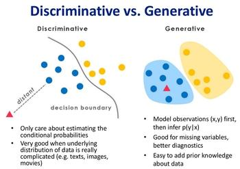
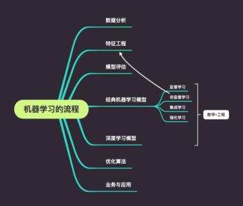

# 机器学习宏观理解

## 机器学习的分类

 

### 分类vs回归vs序列

### 监督vs无监督vs强化

### 判别vs生成

 

其实机器学习的任务是从属性X预测标记Y，即求概率P(Y|X)；对于判别式模型来说求得P(Y|X)，对未见示例X，根据P(Y|X)可以求得标记Y，即可以直接判别出来，如上图的左边所示，实际是就是直接得到了判别边界，所以传统的、耳熟能详的机器学习算法如线性回归模型、支持向量机SVM等都是判别式模型，这些模型的特点都是输入属性X可以直接得到Y（对于二分类任务来说，实际得到一个score，当score大于threshold时则为正类，否则为反类）（根本原因个人认为是对于某示例X_1，对正例和反例的标记的条件概率之和等于1，即P(Y_1|X_1)+P(Y_2|X_1)=1）而生成式模型求得P(Y,X)，对于未见示例X，你要求出X与不同标记之间的联合概率分布，然后大的获胜，如上图右边所示，并没有什么边界存在，对于未见示例（红三角），求两个联合概率分布（有两个类），比较一下，取那个大的。机器学习中朴素贝叶斯模型、隐马尔可夫模型HMM等都是生成式模型，熟悉Naive Bayes的都知道，对于输入X，需要求出好几个联合概率，然后较大的那个就是预测结果（根本原因个人认为是对于某示例X_1，对正例和反例的标记的联合概率不等于1，即P(Y_1,X_1)+P(Y_2,X_1)<1，要遍历所有的X和Y的联合概率求和，即sum(P(X,Y))=1。

举一个例子：判别式模型举例：要确定一个羊是山羊还是绵羊，用判别模型的方法是从历史数据中学习到模型，然后通过提取这只羊的特征来预测出这只羊是山羊的概率，是绵羊的概率。生成式模型举例：利用生成模型是根据山羊的特征首先学习出一个山羊的模型，然后根据绵羊的特征学习出一个绵羊的模型，然后从这只羊中提取特征，放到山羊模型中看概率是多少，在放到绵羊模型中看概率是多少，哪个大就是哪个。细细品味上面的例子，判别式模型是根据一只羊的特征可以直接给出这只羊的概率（比如logistic regression，这概率大于0.5时则为正例，否则为反例），而生成式模型是要都试一试，最大的概率的那个就是最后结果

另外，在机器学习中任务是从属性X预测标记Y，判别模型求的是P(Y|X)，即后验概率；而生成模型最后求的是P(X,Y)，即联合概率。从本质上来说：判别模型之所以称为“判别”模型，是因为其根据X“判别”Y；而生成模型之所以称为“生成”模型，是因为其预测的根据是联合概率P(X,Y)，而联合概率可以理解为“生成”(X,Y)样本的概率分布（或称为 依据）；具体来说，机器学习已知X，从Y的候选集合中选出一个来，可能的样本有(X,Y_1), (X,Y_2), (X,Y_3),……，(X,Y_n),实际数据是如何“生成”的依赖于P(X,Y)，那么最后的预测结果选哪一个Y呢？那就选“生成”概率最大的那个吧

## 机器学习的学习流程

 

## 数学基础
- 微积分
    - 导数和偏导数的定义与计算方法
    - 梯度向量的定义
    - 极值定理，可导函数在极值点处导数或梯度必须为0
    - 雅克比矩阵，这是向量到向量映射函数的偏导数构成的矩阵，在求导推导中会用到
    - Hessian矩阵，这是2阶导数对多元函数的推广，与函数的极值有密切的联系
    - 凸函数的定义与判断方法
    - 泰勒展开公式
    - 拉格朗日乘数法，用于求解带等式约束的极值问题
    - 推荐视频3Blue1Brown的【线性代数的本质】
- 线性代数
    - 向量和它的各种运算，包括加法，减法，数乘，转置，内积
    - 向量和矩阵的范数，L1范数和L2范数
    - 矩阵和它的各种运算，包括加法，减法，乘法，数乘
    - 逆矩阵的定义与性质
    - 行列式的定义与计算方法
    - 二次型的定义
    - 矩阵的正定性
    - 矩阵的特征值与特征向量
    - 矩阵的奇异值分解
    - 线性方程组的数值解法，尤其是共轭梯度法
    - 推荐视频3Blue1Brown的【线性代数】
- 概率论
    - 随机事件的概念，概率的定义与计算方法
    - 随机变量与概率分布，尤其是连续型随机变量的概率密度函数和分布函数
    - 条件概率与贝叶斯公式
    - 常用的概率分布，包括正态分布，伯努利二项分布，均匀分布
    - 随机变量的均值与方差，协方差
    - 随机变量的独立性
    - 最大似然估计
- 优化方法
    - 推荐书籍《凸优化》《非线性规划》

 

