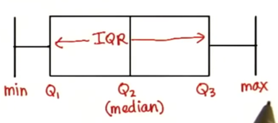

# 数据分析

数据分析贯穿在整个数据产品的生命周期中，但是在不同的阶段，分析数据的角度略有不同。

## 中心测量值(Measures of Center)
- 众数：众数不能描述数据的整体
- 平均值：
    - $\overline{x}=\cfrac{\sum x}{n}$  $\mu=\cfrac{\sum x}{N}$
    - 异常值
- 中位数
   
三者之间的关系
- 三者在不同的案例中各有优势，需要针对数据进行选择
- 在正态分布中，均值、平均值、中位数相等


##  数据分布
- 值域(range)
    - 对异常值敏感
    - 去除头尾
- 四分位差值(IQR)
    - 不受异常值的干扰
    - $IQR=Q_3-Q_1$
    - 箱线图
    <div align="center"> </div>
    - IQR的问题在于没有办法反应所有数值，不同的分布可以有相同的IQR
- 平均差(Deviation from Mean)
    - $Avgdev=\cfrac{\sum x_i-\overline{x}}{n}$ 
    - 存在负值抵消正值
- 平均绝对偏差
    - $Avg-abs-dev=\cfrac{|\sum x_i-\overline{x}|}{n}$ 
- 标准差(SD)
    - $\sigma=\sqrt{\cfrac{(\sum x_i-\overline{x})^2}{n}}$ 
- 贝塞尔校正系数
    - $\sigma=\sqrt{\cfrac{(\sum x_i-\overline{x})^2}{n-1}}$ 
    - 在使用整体数据集中的样本时使用
    
异常值定义
- $Outlier < Q_1-1.5IQR$ 
- $Outlier > Q_3+1.5IQR$


```python
import numpy as np

numbers = [1,2,3,4,5]
mean = np.mean(numbers)
print(mean)
median = np.median(numbers)
print(median)
sd = np.std(numbers)
print(sd)
```

    3.0
    3.0
    1.4142135623730951

