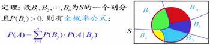
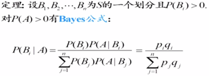
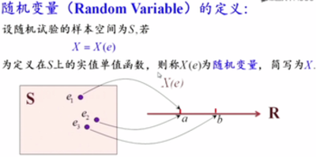
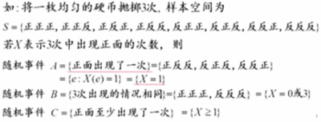
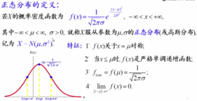

# 数学基础

## 概率论与数理统计
- 频率与概率
- 条件概率, $P(B|A)$指在A发生的条件下，B发生的概率，其实是缩小了样本空间
- 全概率公式
 <div align="center"> </div>
 
- 贝叶斯公式

<div align="center"> </div>

$P(B)$为先验概率，$P(B|A)$为后验概率
- 随机变量/离散随机变量，要注意的是随机变量叫变量，但是其实是一个函数，实质上这是人们偷懒的产物，因为在描述条件的过程非常繁琐，人们使用简单的公式来表述
    - 二项分布
    - 泊松分布
    - 几何分布

<div align="center"> </div>

<div align="center"> </div> 

- 分布函数$F_X(x)=P(X<=x)$，对于任意一种分布的描述
- 连续型续集变量的分布
    - 正态分布(高斯分布)
    - 标准正态分布$\mu=0,\phi=1$
    
<div align="center"> </div>

<div align="center"> </div>


```python

```
