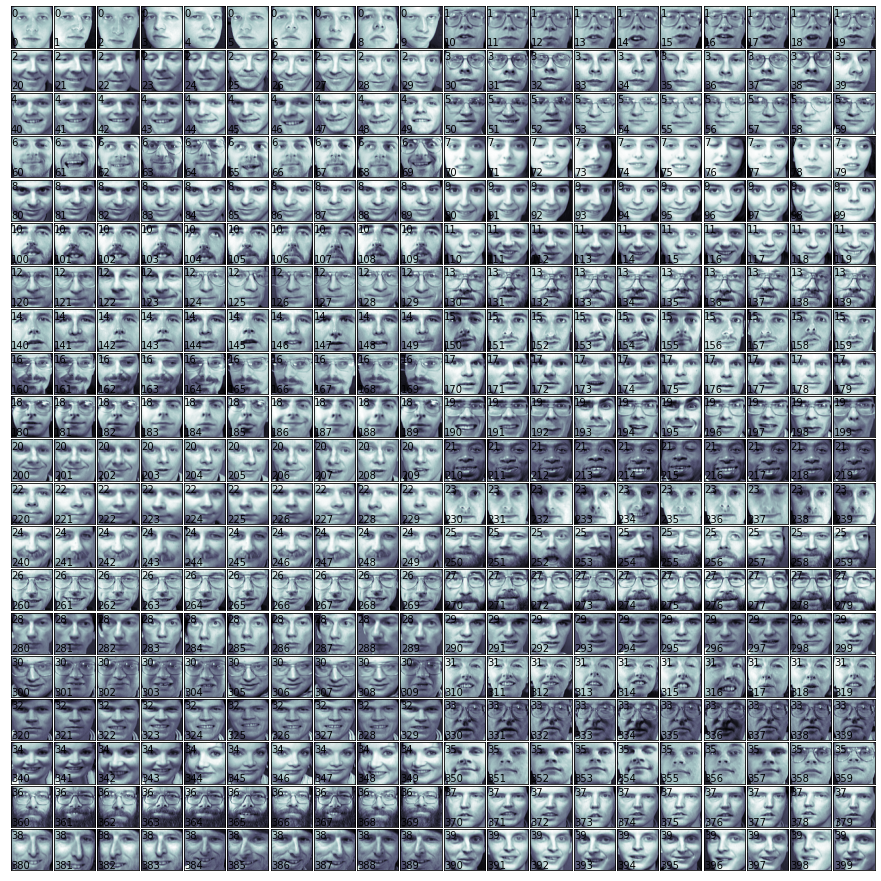
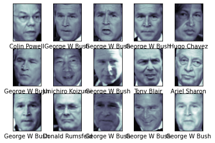
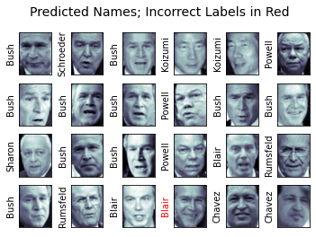
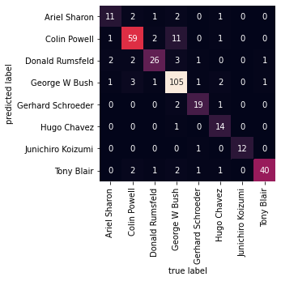

# 支持向量机(Support Vector Machine)

svm primal 问题
svm 优化成dual 问题
线性的svm
svm 线性不可分割的relex方法，松弛变量，使它具有容错性
svm使用kernel 将低维空间的数据映射到高维空间，使其可以被分类；多种常用的kernel function。

求解svm的方法是一个二次规划问题（Quadratic Programming），坐标轮换法(Coordinate Descent) ：将多维的的无约束优化问题转化为一些列一维的最优化问题。

svm扩展到多分类问题。OVR（One versus All）OVO（One versus One）

优势：
理论非常完美
支持不同的kernel，用于调参

缺点：
当数据量特别大时，训练比较慢


```python
## Kernel Linear Regression

## Kernel PCA


```


```python
SVC和SVR
```

## SVM人脸识别项目


```python
import numpy as np
import time
from scipy.stats import sem
# from sklearn.cross_validation import train_test_split
# cross_validation has been deprecated in >=sklearn 0.18
from sklearn.model_selection import train_test_split,cross_val_score
from sklearn.model_selection import KFold,GridSearchCV
from sklearn.svm import SVC
from sklearn.metrics import classification_report
from sklearn.metrics import confusion_matrix
from sklearn.datasets import fetch_olivetti_faces
import ssl
ssl._create_default_https_context = ssl._create_unverified_context
# fetch_olivetti_faces(): certificate verify failed, above line can avoid such err
import matplotlib
# matplotlib.use('TkAgg')  # 'TkAgg' can show GUI in imshow()
# matplotlib.use('Agg')  # 'Agg' will not show GUI
import matplotlib.pyplot as plt
import random
%matplotlib inline
```

查看数据集


```python
def load_images_and_show():
    faces = fetch_olivetti_faces()
    print(faces.images[0], faces.images[0].shape)
#     cnt_show = 6
#     plt.figure(figsize=(16,8))
#     for i in range(1, cnt_show):
#         plt.subplot(1, cnt_show, i)
#         plt.imshow(faces.images[random.randint(0, 400)])
#     plt.colorbar()
#     plt.show()    
    print(faces.DESCR)
    print(faces.keys())
    print(faces.images.shape)
    print(faces.data.shape)
    print(faces.target.shape)
    print(np.max(faces.data))
    print(np.min(faces.data))
    print(np.mean(faces.data))
    return faces

faces = load_images_and_show()
```

    [[0.30991736 0.3677686  0.41735536 ... 0.37190083 0.3305785  0.30578512]
     [0.3429752  0.40495867 0.43801653 ... 0.37190083 0.338843   0.3140496 ]
     [0.3429752  0.41735536 0.45041323 ... 0.38016528 0.338843   0.29752067]
     ...
     [0.21487603 0.20661157 0.2231405  ... 0.15289256 0.16528925 0.17355372]
     [0.20247933 0.2107438  0.2107438  ... 0.14876033 0.16115703 0.16528925]
     [0.20247933 0.20661157 0.20247933 ... 0.15289256 0.16115703 0.1570248 ]] (64, 64)
    .. _olivetti_faces_dataset:
    
    The Olivetti faces dataset
    --------------------------
    
    `This dataset contains a set of face images`_ taken between April 1992 and 
    April 1994 at AT&T Laboratories Cambridge. The
    :func:`sklearn.datasets.fetch_olivetti_faces` function is the data
    fetching / caching function that downloads the data
    archive from AT&T.
    
    .. _This dataset contains a set of face images: http://www.cl.cam.ac.uk/research/dtg/attarchive/facedatabase.html
    
    As described on the original website:
    
        There are ten different images of each of 40 distinct subjects. For some
        subjects, the images were taken at different times, varying the lighting,
        facial expressions (open / closed eyes, smiling / not smiling) and facial
        details (glasses / no glasses). All the images were taken against a dark
        homogeneous background with the subjects in an upright, frontal position 
        (with tolerance for some side movement).
    
    **Data Set Characteristics:**
    
        =================   =====================
        Classes                                40
        Samples total                         400
        Dimensionality                       4096
        Features            real, between 0 and 1
        =================   =====================
    
    The image is quantized to 256 grey levels and stored as unsigned 8-bit 
    integers; the loader will convert these to floating point values on the 
    interval [0, 1], which are easier to work with for many algorithms.
    
    The "target" for this database is an integer from 0 to 39 indicating the
    identity of the person pictured; however, with only 10 examples per class, this
    relatively small dataset is more interesting from an unsupervised or
    semi-supervised perspective.
    
    The original dataset consisted of 92 x 112, while the version available here
    consists of 64x64 images.
    
    When using these images, please give credit to AT&T Laboratories Cambridge.
    
    dict_keys(['data', 'images', 'target', 'DESCR'])
    (400, 64, 64)
    (400, 4096)
    (400,)
    1.0
    0.0
    0.5470426


```python
def print_faces(images, target, top_n):
    # set up figure size in inches
    fig = plt.figure(figsize=(12, 12))
    fig.subplots_adjust(left=0, right=1, bottom=0, top=1, hspace=0.05, wspace=0.05)
    for i in range(top_n):
        # we will print images in matrix 20x20
        p = fig.add_subplot(20, 20, i + 1, xticks=[], yticks=[])
        p.imshow(images[i], cmap=plt.cm.bone)
        # label the image with target value
        p.text(0, 14, str(target[i]))
        p.text(0, 60, str(i))

print_faces(faces.images, faces.target, 400)
```





创建交叉验证函数


```python
def evaluate_cross_validation(clf, X, y, K):
    # K通常取5或者10
    # 对于分类问题，可以使用分层抽样straitified sampling
    # 调参/模型选择/特征选择
    cv = KFold(K, shuffle=True, random_state=0)
    scores = cross_val_score(clf, X, y, cv=cv)
    print (scores)
    print ("Mean score: {0:.3f} (+/-{1:.3f})".format(
        np.mean(scores), sem(scores)))
```

创建训练和评估的函数


```python
def train_and_evaluate(clf, X_train, X_test, y_train, y_test):
    clf.fit(X_train, y_train)

    print ("Accuracy on training set:")
    print (clf.score(X_train, y_train))
    print ("Accuracy on testing set:")
    print (clf.score(X_test, y_test))

    y_pred = clf.predict(X_test)

    print ("Classification Report:")
    print (classification_report(y_test, y_pred))
    print ("Confusion Matrix:")
    print (confusion_matrix(y_test, y_pred))
```

创建SVC1分类器并训练


```python
def train_svc1(): 
    svc_1 = SVC(kernel='linear') 
    # C-Support Vector Classification, based on libsvm
    # The multiclass support is handled according to a one-vs-one scheme.
    # kernel: 'linear', 'poly', 'rbf', 'sigmoid'
    print (svc_1)

    X_train, X_test, y_train, y_test = train_test_split(
            faces.data, faces.target, test_size=0.25, random_state=0)
    evaluate_cross_validation(svc_1, X_train, y_train, 5)
    train_and_evaluate(svc_1, X_train, X_test, y_train, y_test)

train_svc1()
```

    SVC(C=1.0, break_ties=False, cache_size=200, class_weight=None, coef0=0.0,
        decision_function_shape='ovr', degree=3, gamma='scale', kernel='linear',
        max_iter=-1, probability=False, random_state=None, shrinking=True,
        tol=0.001, verbose=False)
    [0.93333333 0.86666667 0.91666667 0.93333333 0.91666667]
    Mean score: 0.913 (+/-0.012)
    Accuracy on training set:
    1.0
    Accuracy on testing set:
    0.99
    Classification Report:
                  precision    recall  f1-score   support
    
               0       0.86      1.00      0.92         6
               1       1.00      1.00      1.00         4
               2       1.00      1.00      1.00         2
               3       1.00      1.00      1.00         1
               4       1.00      1.00      1.00         1
               5       1.00      1.00      1.00         5
               6       1.00      1.00      1.00         4
               7       1.00      0.67      0.80         3
               9       1.00      1.00      1.00         1
              10       1.00      1.00      1.00         4
              11       1.00      1.00      1.00         1
              12       1.00      1.00      1.00         2
              13       1.00      1.00      1.00         3
              14       1.00      1.00      1.00         5
              15       1.00      1.00      1.00         3
              17       1.00      1.00      1.00         6
              19       1.00      1.00      1.00         4
              20       1.00      1.00      1.00         1
              21       1.00      1.00      1.00         1
              22       1.00      1.00      1.00         2
              23       1.00      1.00      1.00         1
              24       1.00      1.00      1.00         2
              25       1.00      1.00      1.00         2
              26       1.00      1.00      1.00         4
              27       1.00      1.00      1.00         1
              28       1.00      1.00      1.00         2
              29       1.00      1.00      1.00         3
              30       1.00      1.00      1.00         4
              31       1.00      1.00      1.00         3
              32       1.00      1.00      1.00         3
              33       1.00      1.00      1.00         2
              34       1.00      1.00      1.00         3
              35       1.00      1.00      1.00         1
              36       1.00      1.00      1.00         3
              37       1.00      1.00      1.00         3
              38       1.00      1.00      1.00         1
              39       1.00      1.00      1.00         3
    
        accuracy                           0.99       100
       macro avg       1.00      0.99      0.99       100
    weighted avg       0.99      0.99      0.99       100
    
    Confusion Matrix:
    [[6 0 0 ... 0 0 0]
     [0 4 0 ... 0 0 0]
     [0 0 2 ... 0 0 0]
     ...
     [0 0 0 ... 3 0 0]
     [0 0 0 ... 0 1 0]
     [0 0 0 ... 0 0 3]]


构建戴眼镜样本的数据集


```python
def create_target(num_sample,segments):
    # create a new y array of target size initialized with zeros
    y = np.zeros(num_sample)
    # put 1 in the specified segments
    for (start, end) in segments:
        y[start:end + 1] = 1
    return y
```


```python
def with_grasses():
    # the index ranges of images of people with glasses
    glasses = [
        (10, 19), (30, 32), (37, 38), (50, 59), (63, 64),
        (69, 69), (120, 121), (124, 129), (130, 139), (160, 161),
        (164, 169), (180, 182), (185, 185), (189, 189), (190, 192),
        (194, 194), (196, 199), (260, 269), (270, 279), (300, 309),
        (330, 339), (358, 359), (360, 369)
    ]
    num_samples = faces.target.shape[0]
    target_glasses = create_target(num_samples, glasses)
    return target_glasses
target_glasses = with_grasses()
```

创建SVC2分类器(分类是否戴眼镜)并训练


```python
def train_svc2():
    svc_2 = SVC(kernel='linear')
    X_train, X_test, y_train, y_test = train_test_split(
            faces.data, target_glasses, test_size=0.25, random_state=0)
    evaluate_cross_validation(svc_2, X_train, y_train, 5)
    train_and_evaluate(svc_2, X_train, X_test, y_train, y_test)
train_svc2()
```

    [1.         0.95       0.98333333 0.98333333 0.93333333]
    Mean score: 0.970 (+/-0.012)
    Accuracy on training set:
    1.0
    Accuracy on testing set:
    0.99
    Classification Report:
                  precision    recall  f1-score   support
    
             0.0       1.00      0.99      0.99        67
             1.0       0.97      1.00      0.99        33
    
        accuracy                           0.99       100
       macro avg       0.99      0.99      0.99       100
    weighted avg       0.99      0.99      0.99       100
    
    Confusion Matrix:
    [[66  1]
     [ 0 33]]


## 另一个使用SVM+PCA做人脸的项目


```python
%matplotlib inline
import numpy as np
import matplotlib.pyplot as plt
import seaborn as sns; 
from sklearn.datasets import fetch_lfw_people
faces = fetch_lfw_people(min_faces_per_person=60)
print(faces.target_names)
print(faces.images.shape)

n_samples, h, w = faces.images.shape
```

    ['Ariel Sharon' 'Colin Powell' 'Donald Rumsfeld' 'George W Bush'
     'Gerhard Schroeder' 'Hugo Chavez' 'Junichiro Koizumi' 'Tony Blair']
    (1348, 62, 47)


查看数据集


```python
fig, ax = plt.subplots(3, 5)
for i, axi in enumerate(ax.flat):
    axi.imshow(faces.images[i], cmap='bone')
    axi.set(xticks=[], yticks=[],
            xlabel=faces.target_names[faces.target[i]])
```





将数据分为训练和测试数据集


```python
from sklearn.model_selection import train_test_split
Xtrain, Xtest, ytrain, ytest = train_test_split(faces.data, faces.target,
                                                random_state=42)

print(Xtrain.shape)
print(Xtest.shape)
```

    (1011, 2914)
    (337, 2914)


我们可以将整个图像展平为一个长度为3000左右的一维向量, 然后使用这个向量做为特征. 通常更有效的方法是通过预处理提取图像最重要的特征. 一个重要的特征提取方法是PCA(主成分分析), 可以将一副图像转换为一个长度为更短的(150)向量.


```python
from sklearn.svm import SVC
from sklearn.decomposition import PCA

n_components = 150
print("从%d张人脸图片中提取出top %d eigenfaces" % (n_components, Xtrain.shape[0]))
pca = PCA(n_components=n_components, svd_solver='randomized',
          whiten=True, random_state=42).fit(Xtrain)

eigenfaces = pca.components_.reshape((n_components, h, w))

print("将输入数据投影到eigenfaces的标准正交基")

Xtrain_pca = pca.transform(Xtrain)
Xtest_pca = pca.transform(Xtest)
```

    从150张人脸图片中提取出top 1011 eigenfaces
    将输入数据投影到eigenfaces的标准正交基


先使用线性svm尝试，作为baseline


```python
svc = SVC(kernel='linear',C=10)
svc.fit(Xtrain_pca, ytrain)
yfit = svc.predict(Xtest_pca)
```


```python
from sklearn.metrics import classification_report
print(classification_report(ytest, yfit,
                            target_names=faces.target_names))
```

                       precision    recall  f1-score   support
    
         Ariel Sharon       0.62      0.67      0.65        15
         Colin Powell       0.76      0.85      0.81        68
      Donald Rumsfeld       0.76      0.81      0.78        31
        George W Bush       0.86      0.80      0.83       126
    Gerhard Schroeder       0.72      0.78      0.75        23
          Hugo Chavez       0.93      0.70      0.80        20
    Junichiro Koizumi       0.92      0.92      0.92        12
           Tony Blair       0.81      0.83      0.82        42
    
             accuracy                           0.81       337
            macro avg       0.80      0.80      0.79       337
         weighted avg       0.81      0.81      0.81       337
    


调参:通过交叉验证寻找最佳的kernel，和其他参数，注意：C(控制间隔的大小)


```python
from sklearn.model_selection import GridSearchCV

#param_grid = {'kernel': ('linear', 'rbf','poly'),'C': [1, 5, 10, 50],
#              'gamma': [0.0001, 0.0005, 0.001, 0.005, 0.01, 0.1], }
param_grid = [
    {'kernel': ['linear'], 'C': [1, 5, 10, 50]},
    {'kernel': ['rbf'], 'C': [1, 5, 10, 50], 'gamma': [0.0001, 0.0005, 0.001, 0.005, 0.01, 0.1]},
    {'kernel': ['poly'], 'C': [1, 5, 10, 50], 'degree':[2,3,4], 'gamma': ['auto']}
]
grid = GridSearchCV(SVC(class_weight='balanced'), param_grid,cv=5)

%time grid.fit(Xtrain_pca, ytrain)
print(grid.best_estimator_)
print(grid.best_params_)
```

    CPU times: user 1min 4s, sys: 0 ns, total: 1min 4s
    Wall time: 1min 5s
    SVC(C=10, break_ties=False, cache_size=200, class_weight='balanced', coef0=0.0,
        decision_function_shape='ovr', degree=3, gamma=0.001, kernel='rbf',
        max_iter=-1, probability=False, random_state=None, shrinking=True,
        tol=0.001, verbose=False)
    {'C': 10, 'gamma': 0.001, 'kernel': 'rbf'}


```python
model = grid.best_estimator_
yfit = model.predict(Xtest_pca)
```

使用训练好的SVM做预测


```python
fig, ax = plt.subplots(4, 6)
for i, axi in enumerate(ax.flat):
    axi.imshow(Xtest[i].reshape(62, 47), cmap='bone')
    axi.set(xticks=[], yticks=[])
    axi.set_ylabel(faces.target_names[yfit[i]].split()[-1],
                   color='black' if yfit[i] == ytest[i] else 'red')
fig.suptitle('Predicted Names; Incorrect Labels in Red', size=14);
```





生成性能报告


```python
from sklearn.metrics import classification_report
print(classification_report(ytest, yfit,
                            target_names=faces.target_names))
```

                       precision    recall  f1-score   support
    
         Ariel Sharon       0.65      0.73      0.69        15
         Colin Powell       0.80      0.87      0.83        68
      Donald Rumsfeld       0.74      0.84      0.79        31
        George W Bush       0.92      0.83      0.88       126
    Gerhard Schroeder       0.86      0.83      0.84        23
          Hugo Chavez       0.93      0.70      0.80        20
    Junichiro Koizumi       0.92      1.00      0.96        12
           Tony Blair       0.85      0.95      0.90        42
    
             accuracy                           0.85       337
            macro avg       0.83      0.84      0.84       337
         weighted avg       0.86      0.85      0.85       337
    


混淆矩阵


```python
from sklearn.metrics import confusion_matrix
mat = confusion_matrix(ytest, yfit)
sns.heatmap(mat.T, square=True, annot=True, fmt='d', cbar=False,
            xticklabels=faces.target_names,
            yticklabels=faces.target_names)
plt.xlabel('true label')
plt.ylabel('predicted label');
```





SVM总结

优点
- 模型只需要保存支持向量, 模型占用内存少, 预测快.
- 分类只取决于支持向量, 适合数据的维度高的情况, 例如DNA数据

缺点
- 训练的时间复杂度为  O[𝑁3]  或者至少  O[𝑁2] , 当数据量巨大时候不合适使用.
- 需要做调参  𝐶  当数据量大时非常耗时间.
